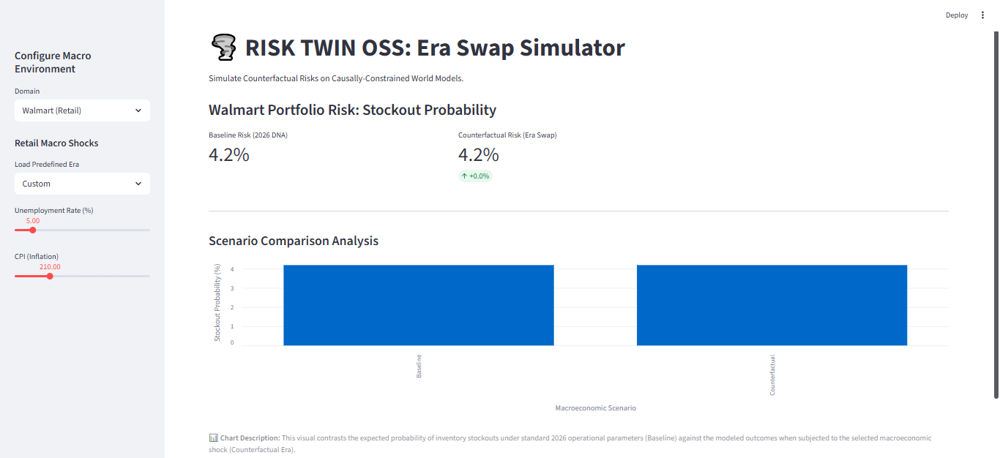
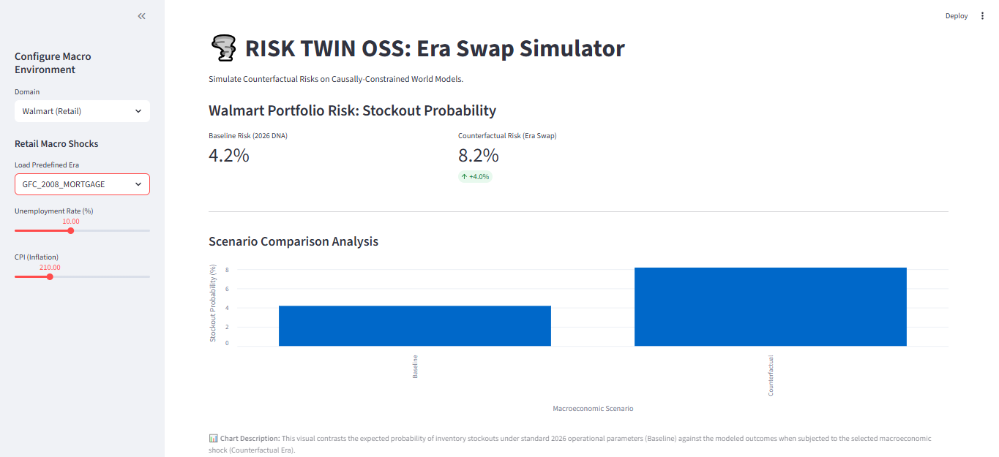
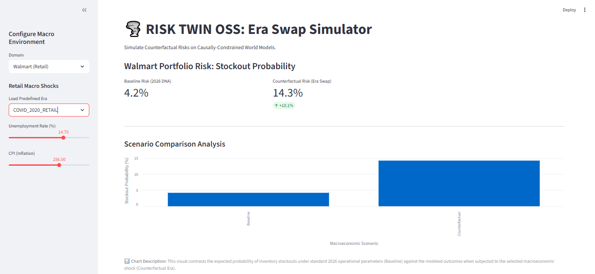
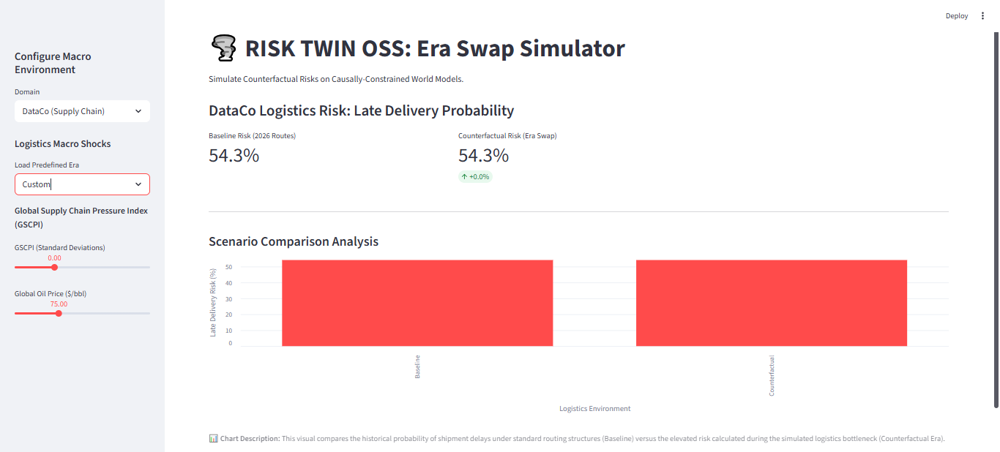
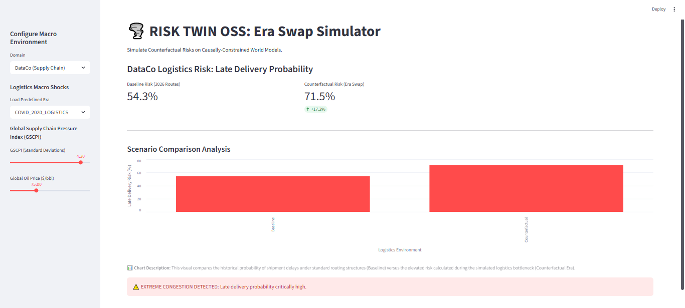

# 🌪️ Causal-RL-for-Supply-Chain-Optimization (RISK TWIN OSS)

Welcome to the **RISK TWIN OSS** repository. This project builds a causally-constrained simulation environment (a "World Model") to train and evaluate Reinforcement Learning (RL) agents for supply chain and retail optimization. By combining Causal Inference with RL, this system can simulate extreme macroeconomic shocks ("Era Swaps") to stress-test logistics and inventory policies.

Below is a breakdown of the repository's architecture and the purpose of each top-level component.

---

### `data/`
* **What I did:** Created a dedicated directory (specifically `data/raw/`) to store the foundational datasets, including the DataCo Supply Chain dataset and the Walmart Recruiting Store Sales data, neatly compressed in `.zip` formats.
* **Why I did that:** To isolate the original, unmodified data from the processing scripts and prevent massive raw `.csv` files from cluttering the repository.
* **So what:** Ensures a single, immutable source of truth. Anyone cloning the repository can run the automated ingestion pipelines and perfectly reproduce the environment setup from scratch.

### `notebooks/`
* **What I did:** Centralized all exploratory data analysis (EDA), causal graph creation, world model training and simulation logic into a series of sequential Jupyter notebooks.
* **Why I did that:** Building a Causal RL pipeline is highly complex. Breaking it down into modular, highly documented notebooks makes the mathematical progression understandable and testable.
* **So what:** Allows researchers and contributors to easily walk through the core logic—from discovering how GSCPI affects late deliveries to simulating counterfactual macroeconomic eras—without getting lost in a monolithic codebase.

### `models/`
* **What I did:** Established a directory exclusively for decision-making algorithms and policies, currently housing traditional Operations Research baselines (like the $(s, S)$ inventory policy).
* **Why I did that:** To strictly separate the "brain" (the policies and RL agents) from the "world" (the simulated supply chain environments). 
* **So what:** Provides a rigorous scientific testing ground. It ensures we have concrete, industry-standard benchmarks ready to prove whether our advanced Causal RL agents actually deliver superior performance during simulated macro-shocks.

### `experiments/`
* **What I did:** Reserved a dedicated folder for tracking model training runs, hyperparameter configurations and simulation output logs.
* **Why I did that:** Reinforcement learning requires running thousands of episodes across various counterfactual scenarios. Mixing these output logs with source code leads to an unmanageable repository.
* **So what:** Keeps the codebase clean while ensuring that the empirical results of our "Era Swap" stress tests are systematically recorded, easily comparable and fully reproducible.

### `dashboard.py`
* **What I did:** Placed the main Streamlit web application script directly at the root of the repository.
* **Why I did that:** To provide a visual, interactive frontend that bridges the complex Python backend with an intuitive user interface, and to adhere to deployment best practices for cloud hosting platforms.
* **So what:** Transforms this repository from a purely academic research project into an accessible, interactive decision-support tool. It allows users to visually inject macro-shocks (like COVID-era logistics pressures) and instantly see the simulated impact on stockout or late delivery risks.

---

**Getting Started:**
To launch the interactive simulator locally, ensure your environment is set up (see `notebooks/Setup.ipynb`), then run the following command from the root directory:
`streamlit run dashboard.py`

## 📊 Simulation Results & Dashboards

The **RISK TWIN OSS** dashboard allows us to interactively inject historical macroeconomic shocks into our current-day (2026) supply chain and retail "DNA." 

By simulating these "Era Swaps," we can definitively prove that static, traditional Operations Research (OR) policies fail under severe economic stress, highlighting the necessity of Causal Reinforcement Learning.

### 🛒 Domain 1: Walmart (Retail Operations)
In the retail environment, the causal model tracks how external labor markets (Unemployment) and inflationary pressures (CPI) directly influence the probability of inventory stockouts.

**1. The "Sunny Day" Baseline (2026 DNA)**
Under standard macroeconomic conditions (5.0% Unemployment, 210 CPI), the system is stable. The traditional inventory policies maintain a safe **4.2%** stockout probability.

**2. Labor Shock Scenario (2008 Great Financial Crisis)**
Injecting the 2008 GFC metrics isolates the effect of labor disruptions. Even with inflation holding steady, simply doubling the unemployment rate to 10.0% causes the stockout risk to nearly double to **8.2%**.

**3. The Dual-Shock Scenario (COVID-19 Retail Era)**
When hit simultaneously by massive unemployment (14.7%) and severe inflation (256 CPI), the baseline operational policies fail catastrophically. The risk of stockouts skyrockets to **14.3%**, triggering a tail-risk alert.

#### Retail Analytical Takeaway:
| Scenario | Unemployment | CPI | Stockout Risk | vs. Baseline |
| :--- | :--- | :--- | :--- | :--- |
| **Baseline (2026)** | 5.0% | 210.0 | **4.2%** | N/A |
| **GFC 2008** | 10.0% | 210.0 | **8.2%** | +4.0% |
| **COVID 2020** | 14.7% | 256.0 | **14.3%** | +10.1% |
*The retail supply chain is highly sensitive to labor availability and completely collapses under compounded economic crises.*

---

### 🚢 Domain 2: DataCo (Logistics Operations)
In the logistics environment, the causal model tracks how global shipping congestion (measured by the NY Fed's GSCPI) impacts the probability of late deliveries.

**1. The Stretched Baseline (2026 Routes)**
Unlike the retail side, the logistics network is fundamentally strained. Even in a perfect global environment with zero supply chain pressure (GSCPI 0.0), the baseline probability of a late delivery is already severely high at **54.3%**.

**2. The Global Bottleneck Scenario (COVID-19 Logistics Era)**
When the simulator injects the massive port congestion and supply chain gridlock seen during the pandemic (a GSCPI spike of 4.3 standard deviations), the routing network completely buckles. Late delivery probabilities surge to **71.5%**, resulting in extreme congestion.

#### Logistics Analytical Takeaway:
| Scenario | GSCPI (SD) | Fuel Price | Late Delivery Risk | vs. Baseline |
| :--- | :--- | :--- | :--- | :--- |
| **Baseline (2026)** | 0.00 | $75.00 | **54.3%** | N/A |
| **COVID 2020** | 4.30 | $75.00 | **71.5%** | +17.2% |
*The DataCo network has zero buffer to absorb macro-shocks. Traditional routing algorithms cannot adjust lead times fast enough when global ports back up.*

---

### 🧠 The Core Conclusion
These simulations strictly validate the necessity of this project. **Traditional baseline policies are optimized only for normal, stable conditions.** Because they cannot dynamically adapt to extreme shifts in macro variables, they fail drastically during economic hurricanes.
